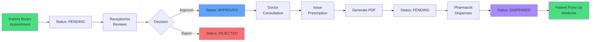

# 🏥 Hospital Management System

A comprehensive, role-based hospital management system built with Flask that streamlines hospital operations including appointment booking, prescription management, pharmacy operations, and patient care.


---

## 📚 Documentation

This project includes comprehensive documentation:

| Document | Description | Level |
|----------|-------------|-------|
| **[SYSTEM_FLOW_DOCUMENTATION.md](SYSTEM_FLOW_DOCUMENTATION.md)** | Complete system architecture, workflows, and detailed explanations | 📖 Comprehensive |
| **[SYSTEM_FLOW_DIAGRAMS.md](SYSTEM_FLOW_DIAGRAMS.md)** | Visual Mermaid diagrams for all system flows | 📊 Visual |
| **[QUICK_REFERENCE.md](QUICK_REFERENCE.md)** | Quick reference guide for developers | ⚡ Quick Start |
| **[README.md](README.md)** | Project overview and setup instructions | 📋 Overview |

---

## ✨ Key Features

### 👥 Multi-Role System
- **5 User Roles**: Admin, Doctor, Patient, Receptionist, Pharmacist
- **Role-Based Access Control (RBAC)**: Secure permissions for each role
- **Custom Dashboards**: Tailored interface for each user type

### 🏥 Core Functionality
- ✅ **Appointment Management**: Book, approve, reject, and track appointments
- ✅ **Prescription System**: Digital prescriptions with PDF generation
- ✅ **Pharmacy Management**: Inventory tracking, stock alerts, expiry monitoring
- ✅ **Medical Chatbot**: AI-powered symptom checker and medical advice
- ✅ **Notification System**: Real-time alerts for all users
- ✅ **User Management**: Complete admin control over users
- ✅ **Patient History**: Comprehensive medical records tracking

### 🔒 Security Features
- JWT token-based authentication
- Password hashing (pbkdf2:sha256)
- HttpOnly cookies (XSS protection)
- Role-based authorization
- Session management with 8-hour expiry
- Account activation/deactivation

---

## 🚀 Quick Start

### Prerequisites
- Python 3.8 or higher
- pip (Python package manager)
- Web browser (Chrome, Firefox, Edge)

### Installation

1. **Clone or Download the Project**
   ```powershell
   cd C:\Users\Danushika\Downloads\Project_hospital
   ```

2. **Create Virtual Environment (Optional but Recommended)**
   ```powershell
   python -m venv venv
   .\venv\Scripts\Activate.ps1
   ```

3. **Install Dependencies**
   ```powershell
   pip install -r requirements.txt
   ```

4. **Create Database Directory**
   ```powershell
   New-Item -ItemType Directory -Path "database" -Force
   ```

5. **Run the Application**
   ```powershell
   python app.py
   ```

6. **Access the System**
   - Open browser: `http://localhost:5000`
   - Use default credentials (see below)

### Default Login Credentials

```
🔑 Admin:        username: admin         password: admin123
🔑 Doctor:       username: doctor1       password: doctor123
🔑 Patient:      username: patient1      password: patient123
🔑 Receptionist: username: receptionist1 password: receptionist123
🔑 Pharmacist:   username: pharmacist1   password: pharmacist123
```

---

## 📁 Project Structure

```
Project_hospital/
├── 📄 app.py                           # Main application entry
├── 📄 auth.py                          # Authentication & authorization
├── 📄 config.py                        # Configuration settings
├── 📄 models.py                        # Database models
├── 📄 requirements.txt                 # Python dependencies
├── 📂 database/                        # Database storage
│   └── hospital.db                    # SQLite database
├── 📂 routes/                          # Blueprint routes
│   ├── admin.py                       # Admin functionality
│   ├── doctor.py                      # Doctor functionality
│   ├── patient.py                     # Patient functionality
│   ├── receptionist.py                # Receptionist functionality
│   └── pharmacist.py                  # Pharmacist functionality
├── 📂 services/                        # Business logic
│   ├── chatbot_service.py             # Medical AI chatbot
│   └── pdf_service.py                 # PDF prescription generator
├── 📂 static/                          # Static assets
│   ├── css/style.css                  # Custom styles
│   ├── js/script.js                   # Custom JavaScript
│   └── prescriptions/                 # Generated PDFs
└── 📂 templates/                       # HTML templates
    ├── login.html                     # Login page
    ├── layouts/base.html              # Base template
    ├── admin/                         # Admin templates
    ├── doctor/                        # Doctor templates
    ├── patient/                       # Patient templates
    ├── pharmacist/                    # Pharmacist templates
    └── receptionist/                  # Receptionist templates
```

---

## 🎯 System Workflow Overview

### Complete Patient Journey



### User Role Overview

```
┌─────────────────────────────────────────────────────────┐
│                    HOSPITAL SYSTEM                      │
└─────────────────────────────────────────────────────────┘
                            │
        ┌──────────────────┼──────────────────┐
        │                  │                  │
    ┌───▼───┐         ┌───▼───┐         ┌───▼───┐
    │PATIENT│         │DOCTOR │         │ADMIN  │
    └───┬───┘         └───┬───┘         └───┬───┘
        │                 │                  │
        │ Books           │ Issues           │ Manages
        │ Appointments    │ Prescriptions    │ Users
        │                 │                  │
        ▼                 ▼                  ▼
   ┌────────┐       ┌──────────┐      ┌─────────┐
   │RECEPT- │       │PHARMA-   │      │System   │
   │IONIST  │       │CIST      │      │Settings │
   └────┬───┘       └────┬─────┘      └─────────┘
        │                │
        │ Approves       │ Dispenses
        │ Appointments   │ Medicine
        ▼                ▼
```

---

## 🔄 Key Workflows

### 1️⃣ Patient Books Appointment
```
Patient → Select Doctor → Choose Date/Time → Add Notes → Submit
    ↓
System creates Appointment (Status: Pending)
    ↓
Receptionist receives notification
```

### 2️⃣ Receptionist Processes Request
```
Receptionist views pending appointments
    ↓
Reviews patient request
    ↓
Approves OR Rejects
    ↓
Patient and Doctor receive notifications
```

### 3️⃣ Doctor Issues Prescription
```
Doctor views approved appointment
    ↓
Conducts consultation
    ↓
Fills prescription form (diagnosis + medicines)
    ↓
System generates PDF prescription
    ↓
Marks appointment as Completed
    ↓
Patient and Pharmacist receive notifications
```

### 4️⃣ Pharmacist Dispenses Medicine
```
Pharmacist views pending prescriptions
    ↓
Verifies patient identity
    ↓
Checks medicine availability
    ↓
Marks prescription as Dispensed
    ↓
Patient receives "Ready for pickup" notification
```

---

## 💻 Technology Stack

| Layer | Technology | Purpose |
|-------|-----------|---------|
| **Frontend** | HTML5, CSS3, Bootstrap 5, JavaScript | User interface |
| **Backend** | Flask 3.0.0 (Python) | Web framework |
| **Database** | SQLite + SQLAlchemy ORM | Data persistence |
| **Authentication** | Flask-JWT-Extended | JWT token management |
| **Security** | Werkzeug | Password hashing |
| **PDF Generation** | ReportLab | Prescription PDFs |
| **Session** | Flask Sessions | User sessions |

---

## 🗄️ Database Schema

### Core Models

**User** → Stores all users (admin, doctor, patient, receptionist, pharmacist)
- Password hashing with pbkdf2:sha256
- Active/inactive status control
- Role-based permissions

**Appointment** → Manages appointment lifecycle
- Links patient and doctor
- Status tracking (Pending → Approved/Rejected → Completed)
- Date, time, and notes

**Prescription** → Digital prescription management
- Links to appointment, doctor, and patient
- Diagnosis and medicine details (JSON)
- Dispensing status tracking

**Medicine** → Pharmacy inventory
- Stock quantity tracking
- Expiry date monitoring
- Low stock alerts (< 50 units)

**Notification** → User notification system
- Real-time alerts
- Read/unread status
- User-specific messages

### Relationships
```
User (1) ──< (N) Appointments (as Patient)
User (1) ──< (N) Appointments (as Doctor)
User (1) ──< (N) Prescriptions (as Patient)
User (1) ──< (N) Prescriptions (as Doctor)
User (1) ──< (N) Notifications
Appointment (1) ──< (N) Prescriptions
```

---

## 🎨 Features by User Role

### 👔 Admin Features
- ✅ View system-wide statistics
- ✅ Create, update, delete users
- ✅ Activate/deactivate user accounts
- ✅ View all appointments and prescriptions
- ✅ Database backup functionality
- ✅ System configuration

### 👨‍⚕️ Doctor Features
- ✅ View approved appointments
- ✅ Access patient medical history
- ✅ Issue digital prescriptions
- ✅ Generate prescription PDFs
- ✅ Complete appointments
- ✅ Receive appointment notifications

### 👤 Patient Features
- ✅ Book appointments with doctors
- ✅ View appointment status
- ✅ Access prescriptions and download PDFs
- ✅ Use medical chatbot for queries
- ✅ View health analytics
- ✅ Receive real-time notifications

### 📋 Receptionist Features
- ✅ View pending appointment requests
- ✅ Approve or reject appointments
- ✅ Manage daily appointment queue
- ✅ View all appointments
- ✅ Send notifications

### 💊 Pharmacist Features
- ✅ View pending prescriptions
- ✅ Dispense medicines
- ✅ Manage medicine inventory
- ✅ Track low stock alerts (< 50 units)
- ✅ Monitor expiry dates (< 30 days warning)
- ✅ View dispensing history

---

## 🤖 AI Chatbot Features

The integrated medical chatbot provides:

### 🩺 Symptom Analysis
- Analyzes common symptoms (fever, headache, cough, etc.)
- Provides possible conditions
- Offers general health advice

### 💊 Medicine Information
- Drug information (uses, dosage, side effects)
- Medication guidance
- Safety warnings

### 🚨 Emergency Detection
- Identifies emergency keywords
- Provides urgent care instructions
- Recommends immediate medical attention

### 📝 General Health Advice
- Preventive care tips
- Lifestyle recommendations
- When to see a doctor

---

## 📊 Key Statistics & Metrics

The system tracks:
- Total registered patients
- Total active doctors
- Appointments today/weekly/monthly
- Pending vs completed appointments
- Prescriptions issued/dispensed
- Low stock medicines
- Medicines expiring soon
- User activity logs

---

## 🔒 Security Implementation

### Authentication
- ✅ JWT token-based (8-hour expiry)
- ✅ HttpOnly cookies (XSS protection)
- ✅ Password hashing (pbkdf2:sha256)
- ✅ Session management

### Authorization
- ✅ Role-based access control (RBAC)
- ✅ Route-level permission checks
- ✅ Resource ownership validation
- ✅ Active status verification

### Data Security
- ✅ SQL injection prevention (ORM)
- ✅ Input validation
- ✅ Secure file storage
- ✅ Cascade delete operations

---

## 🧪 Testing the System

### Test Scenario 1: Complete Patient Flow
1. Login as `patient1`
2. Book appointment with `doctor1`
3. Logout and login as `receptionist1`
4. Approve the appointment
5. Logout and login as `doctor1`
6. Issue prescription for the appointment
7. Logout and login as `pharmacist1`
8. Dispense the prescription
9. Logout and login as `patient1`
10. View dispensed prescription and download PDF

### Test Scenario 2: Chatbot
1. Login as `patient1`
2. Navigate to Chatbot page
3. Test queries:
   - "I have a fever"
   - "What is paracetamol?"
   - "I have chest pain" (emergency test)

### Test Scenario 3: Admin Management
1. Login as `admin`
2. Create new user of any role
3. View all appointments
4. Toggle user active status
5. View system statistics

---

## 📝 API Endpoints Summary

### Public Routes
- `POST /login` - User authentication
- `GET /logout` - User logout

### Protected Routes (Require Authentication + Role)
- `/admin/*` - Admin functions
- `/doctor/*` - Doctor functions
- `/patient/*` - Patient functions
- `/receptionist/*` - Receptionist functions
- `/pharmacist/*` - Pharmacist functions

### API Routes
- `POST /api/chatbot` - Chatbot interactions

---

## 🚀 Deployment Guide

### Development (Current)
```powershell
python app.py
# Access: http://localhost:5000
```

### Production Recommendations

1. **Use Production Database**
   - Switch from SQLite to PostgreSQL/MySQL
   - Update `SQLALCHEMY_DATABASE_URI` in config

2. **Security Enhancements**
   ```python
   JWT_COOKIE_SECURE = True  # HTTPS only
   JWT_CSRF_PROTECT = True   # CSRF protection
   SECRET_KEY = os.environ.get('SECRET_KEY')  # From env vars
   ```

3. **Use Production Server**
   ```powershell
   # Install Waitress (Windows) or Gunicorn (Linux)
   pip install waitress
   waitress-serve --port=5000 app:app
   ```

4. **Set Up Reverse Proxy**
   - Use Nginx or Apache
   - Configure SSL/TLS certificates
   - Enable HTTPS

5. **Environment Variables**
   ```bash
   export SECRET_KEY="your-secret-key"
   export JWT_SECRET_KEY="your-jwt-key"
   export DATABASE_URL="postgresql://..."
   export FLASK_ENV="production"
   ```

---

## 🛠️ Troubleshooting

### Issue: Module not found
```powershell
pip install -r requirements.txt
```

### Issue: Database not found
```powershell
New-Item -ItemType Directory -Path "database" -Force
python app.py  # Creates database automatically
```

### Issue: Permission denied
- Check user `is_active` status in database
- Verify correct role for the route
- Clear browser cookies and re-login

### Issue: JWT errors
- Token expired (8 hours) - re-login required
- Clear browser cookies
- Use incognito mode for testing

---

## 📈 Future Enhancements

### Planned Features
- [ ] Email notifications (SMTP)
- [ ] SMS alerts (Twilio)
- [ ] Video consultations
- [ ] Lab test management
- [ ] Payment gateway integration
- [ ] Medical report uploads
- [ ] Two-factor authentication (2FA)
- [ ] Mobile app (React Native)
- [ ] Real-time chat (WebSocket)
- [ ] Advanced analytics dashboard
- [ ] Appointment reminders
- [ ] Doctor ratings and reviews

---

## 📄 Dependencies

```txt
Flask==3.0.0
Flask-SQLAlchemy==3.1.1
Flask-JWT-Extended==4.6.0
reportlab==4.0.7
python-dateutil==2.8.2
Werkzeug==3.0.1
```

---

## 🤝 Contributing

This is an educational project. Feel free to:
- Fork the repository
- Submit issues
- Create pull requests
- Suggest improvements

---

## 📜 License

This project is created for educational purposes. Use it freely for learning and development.

---

## 👨‍💻 Development Team

**System Architecture**: Comprehensive role-based hospital management system  
**Documentation**: Complete with flow diagrams and quick reference  
**Development Date**: February 2026  
**Version**: 1.0.0

---

## 📞 Support

For issues or questions:
1. Check the [QUICK_REFERENCE.md](QUICK_REFERENCE.md) for common solutions
2. Review the [SYSTEM_FLOW_DOCUMENTATION.md](SYSTEM_FLOW_DOCUMENTATION.md) for detailed explanations
3. Examine the [SYSTEM_FLOW_DIAGRAMS.md](SYSTEM_FLOW_DIAGRAMS.md) for visual guides

---

## 🎓 Learning Outcomes

By studying this project, you'll learn:
- ✅ Flask web application development
- ✅ RESTful API design
- ✅ JWT authentication implementation
- ✅ Role-based access control (RBAC)
- ✅ SQLAlchemy ORM usage
- ✅ PDF generation with ReportLab
- ✅ Session management
- ✅ MVC architecture pattern
- ✅ Database relationship modeling
- ✅ Security best practices

---

## ⭐ Features Highlight

```
🏥 Hospital Management System

├── 👥 5 User Roles (Admin, Doctor, Patient, Receptionist, Pharmacist)
├── 📅 Appointment Management (Book, Approve, Complete)
├── 💊 Prescription System (Issue, Dispense, PDF Generation)
├── 🏪 Pharmacy Inventory (Stock Tracking, Alerts)
├── 🤖 AI Medical Chatbot (Symptoms, Medicines, Emergency)
├── 🔔 Notification System (Real-time Alerts)
├── 🔒 Secure Authentication (JWT, Password Hashing)
├── 👔 Admin Panel (User Management, Statistics)
└── 📊 Analytics Dashboard (Patient, Doctor, System Metrics)
```

---

## 🌟 Getting Started Checklist

- [ ] Python 3.8+ installed
- [ ] Dependencies installed (`pip install -r requirements.txt`)
- [ ] Database directory created
- [ ] Application running (`python app.py`)
- [ ] Accessed login page (`http://localhost:5000`)
- [ ] Tested with default credentials
- [ ] Explored different user roles
- [ ] Read documentation files

---

**Made with ❤️ for learning and hospital management efficiency**

**Version**: 1.0.0 | **Last Updated**: February 17, 2026
