# Hospital Management System - Visual Flow Diagrams

## Complete System Flow Diagrams using Mermaid

This document contains detailed visual representations of all system flows and interactions in the Hospital Management System.

---

## 1. Complete System Architecture

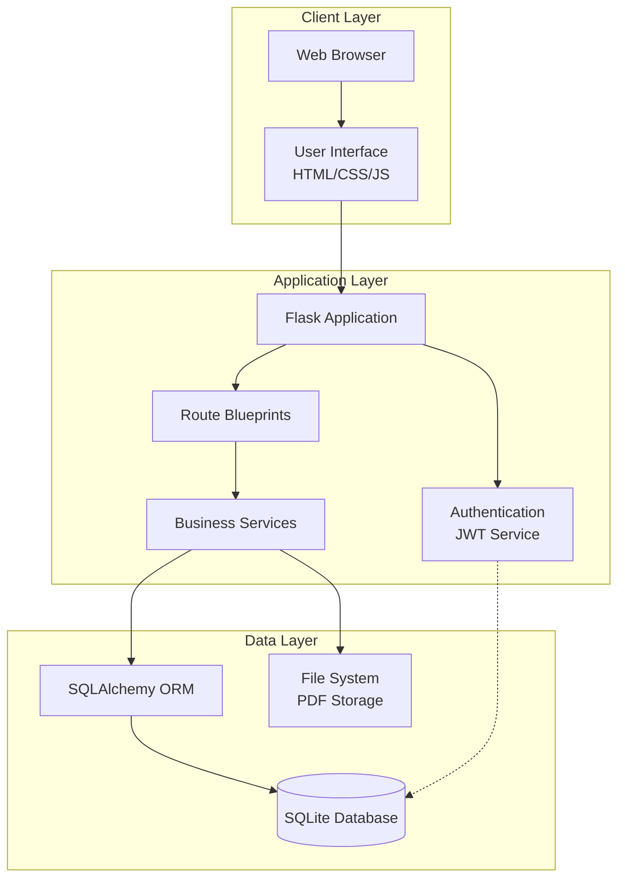

---

## 2. User Authentication & Authorization Flow

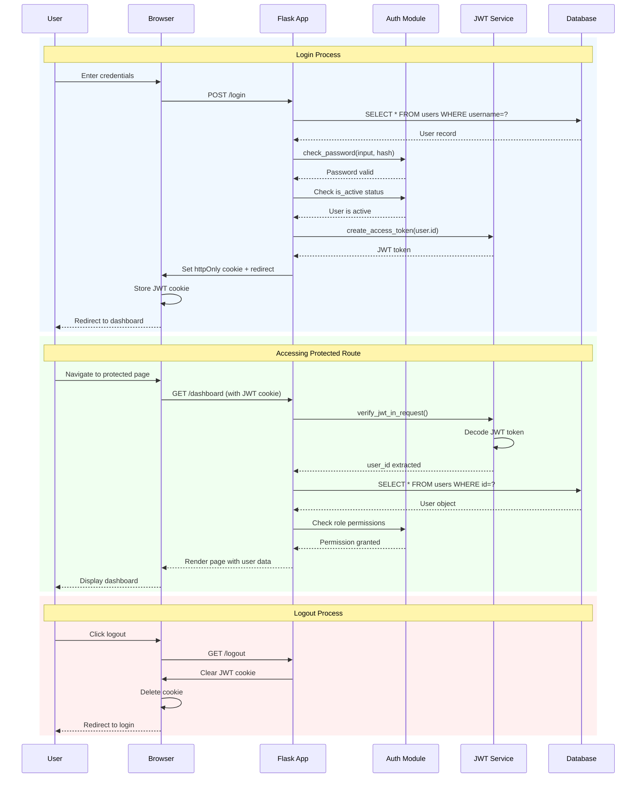

---

## 3. Complete Patient Journey

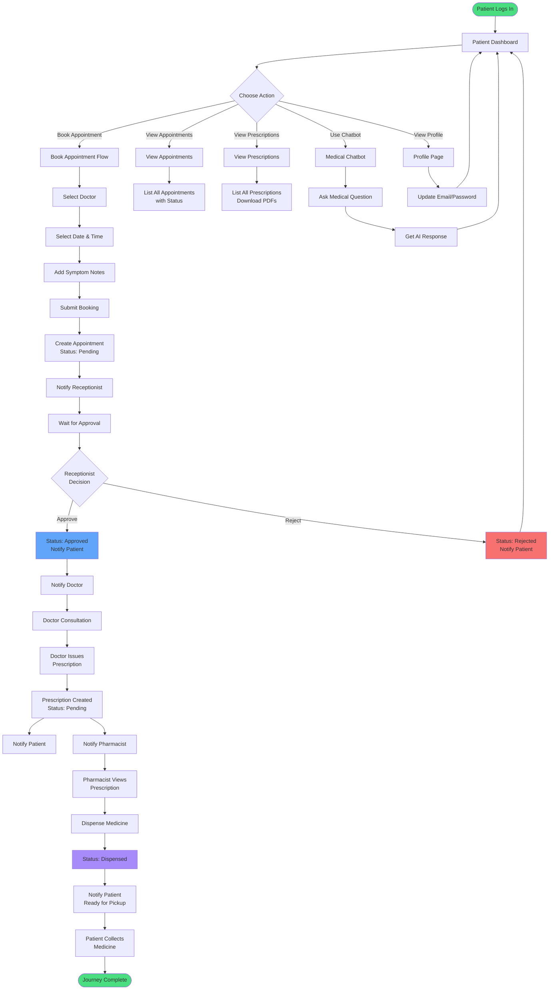

---

## 4. Receptionist Appointment Management Flow

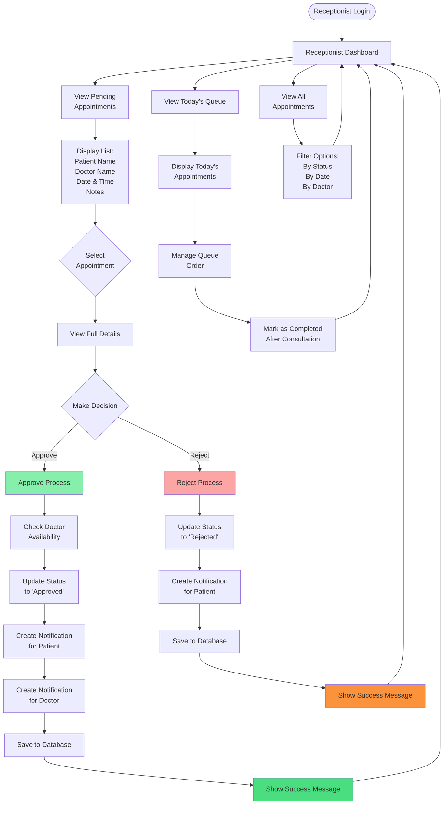

---

## 5. Doctor Workflow - Consultation & Prescription

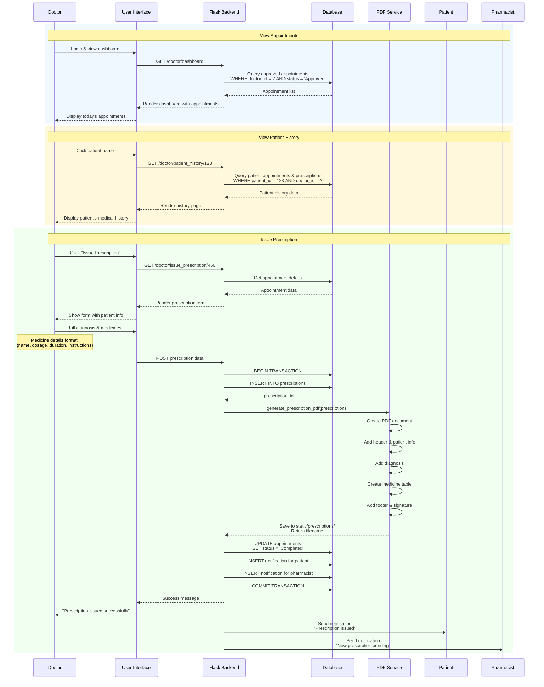

---

## 6. Pharmacist Medicine Dispensing Flow

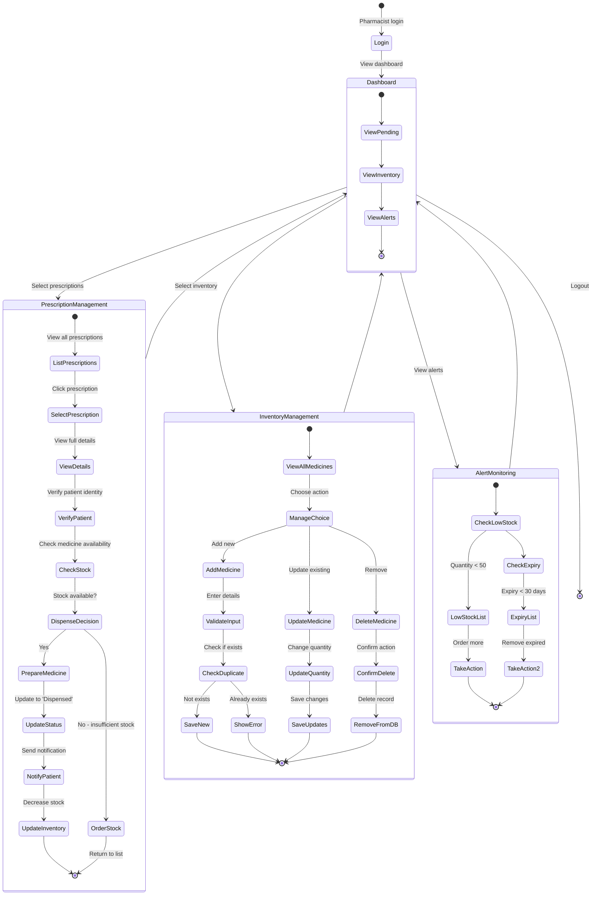

---

## 7. Admin User Management Flow

```mermaid
graph TD
    Start([Admin Login]) --> Dashboard[Admin Dashboard]
    
    Dashboard --> Stats[View Statistics:<br/>Total Patients<br/>Total Doctors<br/>Appointments Today<br/>Total Prescriptions]
    
    Dashboard --> UserMgmt[User Management]
    UserMgmt --> ViewUsers[View All Users]
    ViewUsers --> UserList[Display User List<br/>Username | Email | Role | Status]
    
    UserList --> Action{Select Action}
    
    Action -->|Add User| AddFlow[Add New User]
    Action -->|Update User| UpdateFlow[Update Existing User]
    Action -->|Toggle Status| ToggleFlow[Activate/Deactivate User]
    Action -->|Delete User| DeleteFlow[Delete User]
    
    AddFlow --> AddForm[Show Add User Form]
    AddForm --> FillDetails[Fill Details:<br/>Username<br/>Email<br/>Password<br/>Role]
    FillDetails --> ValidateAdd[Validate Input]
    ValidateAdd --> CheckUnique{Username/Email<br/>Unique?}
    CheckUnique -->|Yes| HashPassword[Hash Password<br/>pbkdf2:sha256]
    CheckUnique -->|No| ErrorUnique[Show Error:<br/>Already Exists]
    ErrorUnique --> AddForm
    HashPassword --> CreateUser[Create User Record]
    CreateUser --> SaveUser[Save to Database]
    SaveUser --> SuccessAdd[Show Success Message]
    SuccessAdd --> ViewUsers
    
    UpdateFlow --> SelectUser[Select User to Update]
    SelectUser --> UpdateForm[Show Update Form<br/>Pre-filled Data]
    UpdateForm --> ModifyFields[Modify:<br/>Email<br/>Role<br/>Password optional]
    ModifyFields --> ValidateUpdate[Validate Input]
    ValidateUpdate --> SaveUpdate[Update Database]
    SaveUpdate --> SuccessUpdate[Show Success Message]
    SuccessUpdate --> ViewUsers
    
    ToggleFlow --> SelectToggle[Select User]
    SelectToggle --> CheckStatus{Current<br/>Status?}
    CheckStatus -->|Active| Deactivate[Set is_active = False]
    CheckStatus -->|Inactive| Activate[Set is_active = True]
    Deactivate --> SaveToggle[Update Database]
    Activate --> SaveToggle
    SaveToggle --> SuccessToggle[Show Success Message]
    SuccessToggle --> ViewUsers
    
    DeleteFlow --> SelectDelete[Select User to Delete]
    SelectDelete --> ConfirmDelete{Confirm<br/>Deletion?}
    ConfirmDelete -->|Yes| CascadeDelete[Delete User<br/>Cascade to:<br/>- Appointments<br/>- Notifications]
    ConfirmDelete -->|No| ViewUsers
    CascadeDelete --> RemoveDB[Remove from Database]
    RemoveDB --> SuccessDelete[Show Success Message]
    SuccessDelete --> ViewUsers
    
    Dashboard --> ViewAppts[View All Appointments]
    ViewAppts --> ApptFilters[Filter by:<br/>Status<br/>Date Range<br/>Doctor<br/>Patient]
    ApptFilters --> ApptReport[Generate Report]
    ApptReport --> Dashboard
    
    Dashboard --> ViewPrescriptions[View All Prescriptions]
    ViewPrescriptions --> RxFilters[Filter by:<br/>Doctor<br/>Patient<br/>Status<br/>Date Range]
    RxFilters --> RxReport[Generate Report]
    RxReport --> Dashboard
    
    Dashboard --> BackupDB[Database Backup]
    BackupDB --> CreateBackup[Create Backup Copy]
    CreateBackup --> Timestamp[Add Timestamp]
    Timestamp --> SaveBackup[Save to<br/>database/backups/]
    SaveBackup --> ConfirmBackup[Confirm Backup Created]
    ConfirmBackup --> Dashboard
    
    style SuccessAdd fill:#4ade80
    style SuccessUpdate fill:#4ade80
    style SuccessToggle fill:#4ade80
    style SuccessDelete fill:#4ade80
    style ErrorUnique fill:#f87171
```

---

## 8. Patient Chatbot Interaction Flow

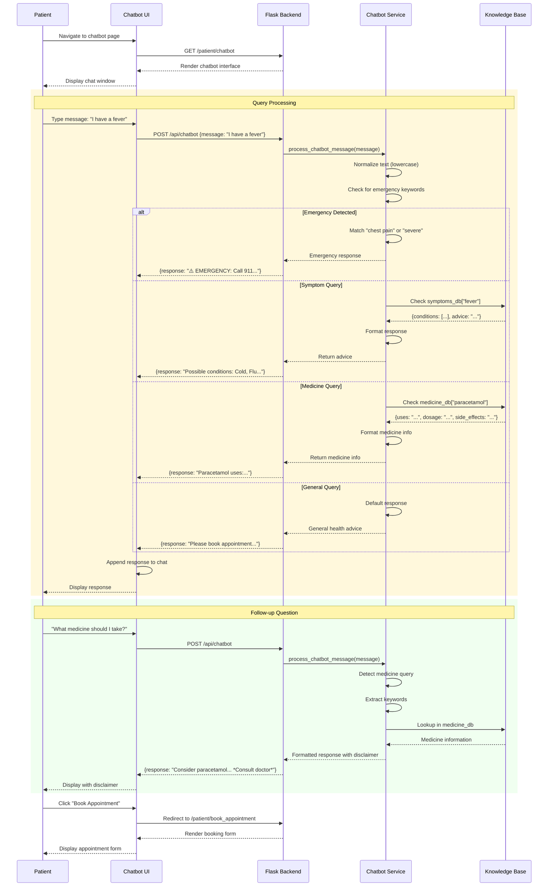

---

## 9. Database Relationships & Data Flow

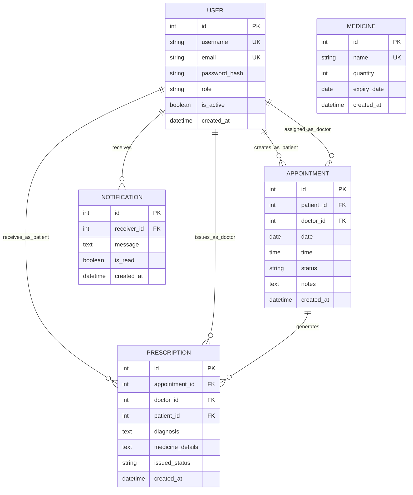

---

## 10. Prescription PDF Generation Flow

```mermaid
graph TD
    Start([Doctor Issues Prescription]) --> CreateRecord[Create Prescription Record<br/>in Database]
    CreateRecord --> CallPDF[Call PDF Service<br/>generate_prescription_pdf]
    
    CallPDF --> InitPDF[Initialize ReportLab<br/>SimpleDocTemplate]
    InitPDF --> SetupPage[Setup Page:<br/>Letter size<br/>Margins]
    
    SetupPage --> AddHeader[Add Header Section]
    AddHeader --> HospitalName[Hospital Name<br/>& Logo]
    HospitalName --> HospitalInfo[Hospital Address<br/>Phone Number]
    
    HospitalInfo --> AddTitle[Add Title:<br/>'PRESCRIPTION']
    AddTitle --> AddDivider1[Add Horizontal Line]
    
    AddDivider1 --> AddMetadata[Add Metadata Section]
    AddMetadata --> PrescriptionID[Prescription ID: #XXX]
    PrescriptionID --> IssuedDate[Issued Date]
    
    IssuedDate --> AddPatientInfo[Add Patient Information]
    AddPatientInfo --> PatientName[Patient Name]
    PatientName --> PatientID[Patient ID]
    
    PatientID --> AddDoctorInfo[Add Doctor Information]
    AddDoctorInfo --> DoctorName[Doctor Name]
    DoctorName --> DoctorID[Doctor ID]
    
    DoctorID --> AddDivider2[Add Horizontal Line]
    AddDivider2 --> AddDiagnosis[Add Diagnosis Section]
    AddDiagnosis --> DiagnosisText[Diagnosis:<br/>Patient's condition]
    
    DiagnosisText --> AddMedicineSection[Add Medicine Section]
    AddMedicineSection --> ParseJSON[Parse medicine_details JSON]
    ParseJSON --> CreateTable[Create Medicine Table]
    
    CreateTable --> TableHeaders[Table Headers:<br/>Medicine | Dosage | Frequency | Duration | Instructions]
    TableHeaders --> AddRows[Add Medicine Rows]
    AddRows --> StyleTable[Apply Table Styling:<br/>- Grid lines<br/>- Header background<br/>- Alternating rows]
    
    StyleTable --> AddSignature[Add Signature Section]
    AddSignature --> DoctorSignLine[Doctor's Signature: ___________]
    DoctorSignLine --> DateSignLine[Date: ___________]
    
    DateSignLine --> AddFooter[Add Footer]
    AddFooter --> FooterText[Hospital Contact<br/>Disclaimer Text]
    
    FooterText --> BuildPDF[Build PDF Document]
    BuildPDF --> SaveFile[Save to File:<br/>static/prescriptions/<br/>prescription_ID_timestamp.pdf]
    
    SaveFile --> Return[Return Filename]
    Return --> End([PDF Generated])
    
    style Start fill:#4ade80
    style End fill:#4ade80
    style CreateTable fill:#60a5fa
    style SaveFile fill:#a78bfa
```

---

## 11. Notification System Flow

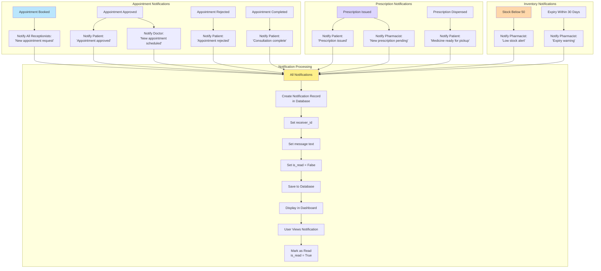

---

## 12. Medicine Inventory Management Flow

```mermaid
stateDiagram-v2
    [*] --> InitialState: System Start
    
    InitialState --> CheckInventory: Scheduled Check
    
    state CheckInventory {
        [*] --> ScanAllMedicines
        ScanAllMedicines --> CheckQuantity: For each medicine
        
        CheckQuantity --> LowStockDetected: quantity < 50
        CheckQuantity --> NormalStock: quantity >= 50
        
        NormalStock --> CheckExpiry
        
        state CheckExpiry {
            [*] --> GetExpiryDate
            GetExpiryDate --> CalculateDaysLeft
            CalculateDaysLeft --> ExpiryStatus
        }
        
        CheckExpiry --> Expired: expiry_date < today
        CheckExpiry --> ExpiresSoon: expiry_date < 30 days
        CheckExpiry --> ExpiryOK: expiry_date >= 30 days
        
        LowStockDetected --> CreateLowStockAlert
        Expired --> CreateExpiryAlert: Critical!
        ExpiresSoon --> CreateExpiryWarning
        ExpiryOK --> [*]
        
        CreateLowStockAlert --> NotifyPharmacist1
        CreateExpiryAlert --> NotifyPharmacist2
        CreateExpiryWarning --> NotifyPharmacist3
        
        NotifyPharmacist1 --> [*]
        NotifyPharmacist2 --> [*]
        NotifyPharmacist3 --> [*]
    }
    
    CheckInventory --> PharmacistAction: Alert received
    
    state PharmacistAction {
        [*] --> ViewAlerts
        ViewAlerts --> DecideAction
        
        DecideAction --> OrderMore: Low stock
        DecideAction --> RemoveExpired: Expired
        DecideAction --> MonitorClosely: Expiring soon
        
        OrderMore --> UpdateQuantity
        UpdateQuantity --> AddToInventory
        AddToInventory --> [*]
        
        RemoveExpired --> DeleteMedicine
        DeleteMedicine --> [*]
        
        MonitorClosely --> [*]
    }
    
    PharmacistAction --> CheckInventory: Continuous monitoring
    
    state DispensingFlow {
        [*] --> ReceivePrescription
        ReceivePrescription --> ParseMedicines
        ParseMedicines --> CheckAvailability
        
        CheckAvailability --> SufficientStock: Available
        CheckAvailability --> InsufficientStock: Not enough
        
        SufficientStock --> DeductQuantity
        DeductQuantity --> UpdateInventoryRecord
        UpdateInventoryRecord --> MarkDispensed
        MarkDispensed --> [*]
        
        InsufficientStock --> NotifyShortage
        NotifyShortage --> [*]
    }
    
    PharmacistAction --> DispensingFlow: Dispense prescription
    DispensingFlow --> CheckInventory: Update triggers check
```

---

## 13. Error Handling & Exception Flow

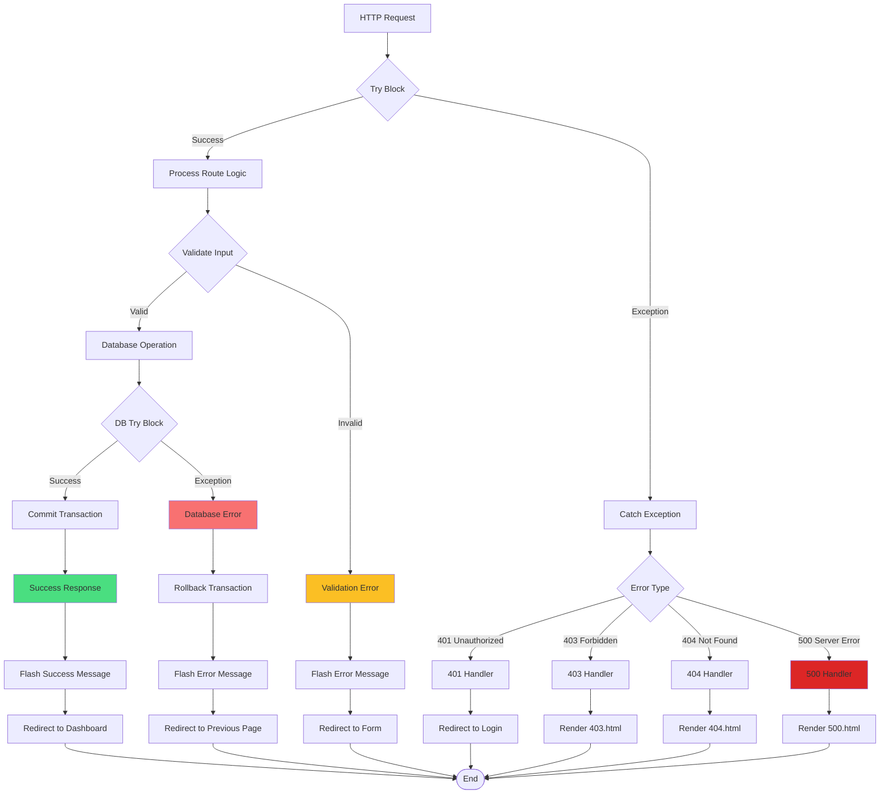

---

## 14. Session Management & Security Flow

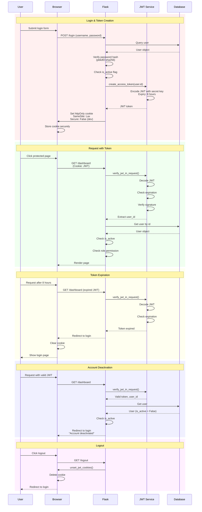

---

## 15. Complete Data Flow Summary

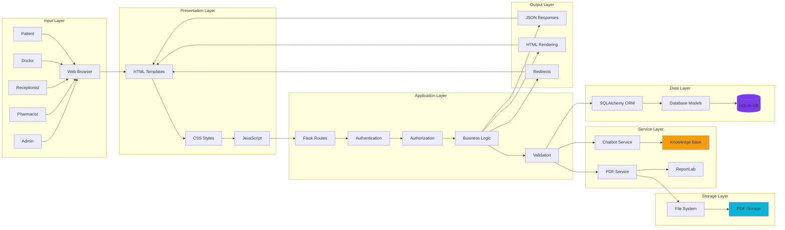

---

## Conclusion

These comprehensive flow diagrams provide a complete visual representation of the Hospital Management System's operations, covering all user roles, workflows, and system interactions. Each diagram can be rendered using Mermaid in compatible markdown viewers or documentation platforms.

**Key Takeaways:**
- ✅ Role-based access control with 5 distinct user types
- ✅ Complete appointment lifecycle from booking to completion
- ✅ Prescription management with PDF generation
- ✅ Real-time notification system
- ✅ Medicine inventory tracking with alerts
- ✅ Secure authentication using JWT tokens
- ✅ Comprehensive error handling
- ✅ Patient chatbot for medical queries

---

**Document Version**: 1.0  
**Compatible with**: Mermaid 9.x+  
**Last Updated**: February 17, 2026
